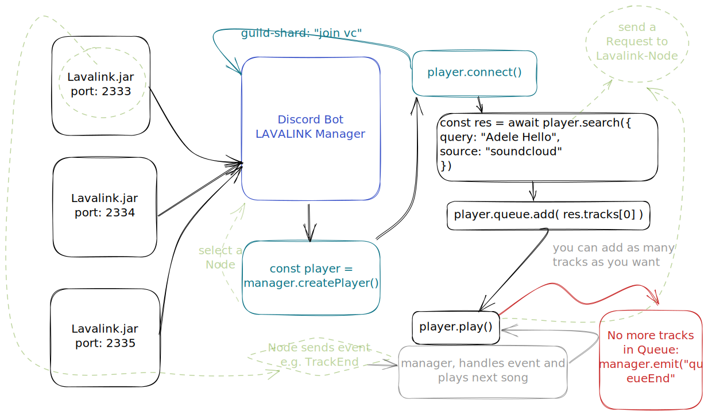

# Documentation

## Important <mark style="color:red;">Classes</mark>:


[lavalinkmanager](docs/lavalinkmanager/)



[nodemanager](docs/nodemanager/)



[player](docs/player/)



[other-types](docs/other-types/)



[other-utils-and-classes](docs/other-utils-and-classes/)


## Graphical Display

